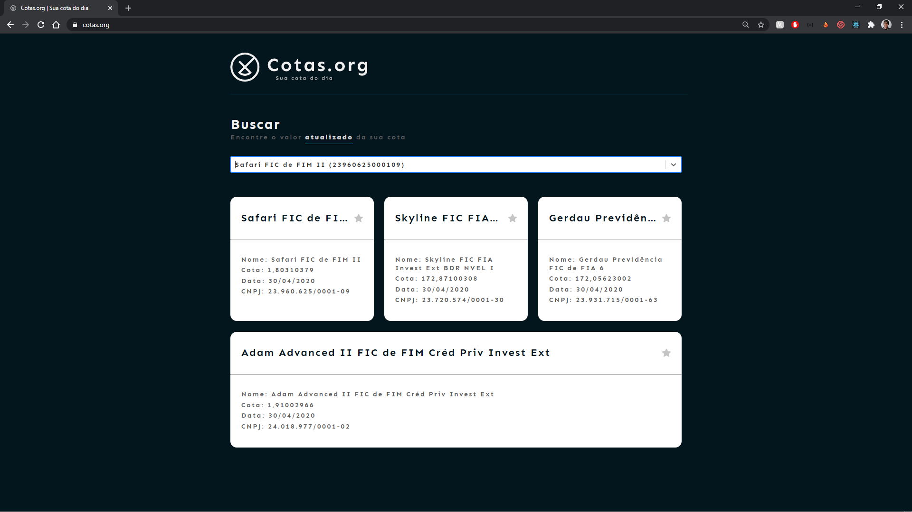

# Busca-Cotas-Fundos

Buscando resolver a defasagem nos dados das cotas do fundos, criamos esse scraper, 
que busca os dados diretamente nas administradoras (que são obrigadas a atulizar as cotas todos os dia de manhã)
e fornece em forma de API/JSON para consultas

## Backend

A versão mais recente do backend está na branch "backend-deeploy"

O backend foi estruturado em AdonisJS e o banco de dados utilizado foi o postgres.

O rota principal é a api.cotas.org/funds que lista todos os fundos cadastrados no nosso DB.
As outras rotas são auxiliares (consultas específicas, criação, deleção e atualização).

A rota api.cotas.org/funds/aux/updateAll é utilizada para atualizar nosso DB com a cota do dia de cada fundo

 
┌───────────────────────┬───────────┬──────────────────────────────┬───────────────────────┐
│ Route                 │ Verb(s)   │ Handler                      │ Name                  │
├───────────────────────┼───────────┼──────────────────────────────┼───────────────────────┤
│ /funds                │ HEAD,GET  │ FundController.index         │ funds.index           │
├───────────────────────┼───────────┼──────────────────────────────┼───────────────────────┤
│ /funds                │ POST      │ FundController.store         │ funds.store           │
├───────────────────────┼───────────┼──────────────────────────────┼───────────────────────┤
│ /funds/:id            │ HEAD,GET  │ FundController.show          │ funds.show            │
├───────────────────────┼───────────┼──────────────────────────────┼───────────────────────┤
│ /funds/:id            │ PUT,PATCH │ FundController.update        │ funds.update          │
├───────────────────────┼───────────┼──────────────────────────────┼───────────────────────┤
│ /funds/:id            │ DELETE    │ FundController.destroy       │ funds.destroy         │
├───────────────────────┼───────────┼──────────────────────────────┼───────────────────────┤
│ /funds/aux/cnpj/:cnpj │ HEAD,GET  │ AuxFundsController.show      │ /funds/aux/cnpj/:cnpj │
├───────────────────────┼───────────┼──────────────────────────────┼───────────────────────┤
│ /funds/aux/updateAll  │ HEAD,GET  │ AuxFundsController.updateAll │ /funds/aux/updateAll  │
└───────────────────────┴───────────┴──────────────────────────────┴───────────────────────┘

## Frontend

A versão mais recente do backend está na branch "frontend-deeploy"

O nosso frontend foi desenvolvido em ReactJS e está disponível <a href="https://cotas.org" target="_blank" title="cotas.org">Aqui</a>

A ideia dele é basicamete de servir como exemplo do que pode ser feito utilizado nossa API

